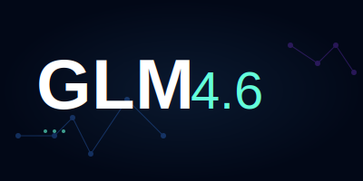

# Tactical Football Simulator

<div align="center">

</div>

一个基于React和TypeScript的交互式战术足球模拟器，利用AI生成实时比赛解说和动态事件。

## 项目概述

Tactical Football Simulator是一个功能丰富的足球比赛模拟应用，提供：
- 实时比赛模拟与3D/2D视图切换
- AI生成的动态解说和比赛事件
- 球员位置动态更新与球权控制
- 比赛事件（进球、黄牌、红牌）处理
- 比分实时更新和比赛统计
- 游戏速度控制

## 技术栈

- **前端框架**: React 18 + TypeScript
- **构建工具**: Vite 6.4.1
- **样式**: Tailwind CSS
- **图标**: Lucide React
- **AI集成**: 自定义AI服务 (geminiService)
- **状态管理**: React Hooks (useState, useEffect, useRef)

## 项目结构

```
├── components/          # React组件
│   ├── BallMarker.tsx  # 足球标记组件
│   ├── MatchInfo.tsx   # 比赛信息显示组件
│   ├── Pitch.tsx       # 足球场组件
│   └── PlayerMarker.tsx # 球员标记组件
├── services/            # 服务层
│   └── geminiService.ts # AI比赛模拟服务
├── App.tsx             # 主应用组件
├── constants.ts        # 常量定义（球队、球员数据）
├── types.ts            # TypeScript类型定义
├── .env.local          # 环境变量配置
├── tsconfig.json       # TypeScript配置
└── vite.config.ts      # Vite配置
```

## 核心功能

### 1. 比赛模拟系统

- **实时时间控制**: 从0到90分钟的完整比赛流程
- **事件生成**: AI驱动的比赛事件（进球、黄牌、红牌）
- **比分更新**: 基于比赛事件的实时比分计算
- **球员动态**: 基于比赛事件的球员评分调整

### 2. 可视化系统

- **3D/2D视图切换**: 支持2D和3D两种比赛视图
- **球员标记**: 显示球员位置、号码和状态
- **足球动画**: 流畅的足球移动和传球动画
- **事件高亮**: 重要事件（如进球）的视觉突出显示

### 3. 解说系统

- **实时解说**: 基于比赛事件的动态解说文本
- **类型区分**: 普通解说、重要事件解说、进球特别解说
- **滚动显示**: 自动滚动的解说栏，确保不错过任何精彩时刻

### 4. 控制系统

- **播放/暂停**: 控制比赛的开始、暂停和继续
- **速度调节**: 可调节比赛进行速度
- **自动结束**: 90分钟后自动结束比赛

## 安装与运行

### 先决条件

- Node.js 18+ 环境
- 有效的API密钥（用于AI服务）

### 安装步骤

1. **克隆项目**
   ```bash
   git clone <repository-url>
   cd tactical-football-simulator
   ```

2. **安装依赖**
   ```bash
   npm install
   ```

3. **配置环境变量**
   在`.env.local`文件中设置API密钥：
   ```
   API_KEY=your-api-key-here
   ```

4. **启动开发服务器**
   ```bash
   npm run dev
   ```

5. **访问应用**
   打开浏览器访问：
   ```
   http://localhost:3000
   ```

### 构建生产版本

```bash
npm run build
```

构建后的文件将输出到`dist`目录。

## 核心组件说明

### App.tsx
主应用组件，包含：
- 比赛状态管理
- 动画循环控制
- AI数据获取与处理
- 事件分发与更新

### Pitch.tsx
足球场组件，负责：
- 球场可视化（2D/3D）
- 球员和足球位置渲染
- 视图切换逻辑

### MatchInfo.tsx
比赛信息组件，显示：
- 比分、时间
- 球队信息
- 控制按钮（播放/暂停、视图切换、速度控制）

### geminiService.ts
AI服务集成，处理：
- 比赛事件模拟
- 解说文本生成
- 比分更新计算

## 类型系统

项目使用TypeScript严格定义数据结构：

- **Player**: 球员信息（ID、姓名、位置、评分等）
- **Team**: 球队信息（名称、缩写、球员列表、比分等）
- **Ball**: 足球状态（位置、高度、所有者等）
- **MatchEvent**: 比赛事件（类型、时间、球员等）
- **Commentary**: 解说内容（时间、文本、类型等）
- **SimulationResponse**: AI模拟响应数据结构

## 扩展与贡献

### 自定义球队数据

可以在`constants.ts`文件中修改或添加球队数据：

```typescript
export const INITIAL_HOME_TEAM: Team = {
  id: 'team1',
  name: 'Your Team Name',
  abbreviation: 'YTN',
  color: '#000000',
  // ...其他配置
};
```

### 添加新功能

1. 创建新的React组件
2. 在`types.ts`中定义相关类型
3. 更新`App.tsx`集成新功能
4. 在`geminiService.ts`中扩展AI服务调用

## 故障排除

### API密钥错误

如果看到API密钥错误提示，请确保：
- `.env.local`文件已正确创建
- API密钥格式正确
- 密钥具有相应的权限

### 依赖安装问题

如果遇到依赖安装问题，尝试：
```bash
npm cache clean --force
rm -rf node_modules
npm install
```

## 许可证

MIT License

## 联系方式

如有问题或建议，请通过以下方式联系：
- 项目Issues: [GitHub Issues]
- 电子邮件: [tzh_tian@126.com]

---

享受比赛！⚽